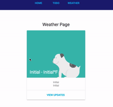

# Create React Redux App

This project was bootstrapped with Create React App and Redux Structure.

Todo List (Redux):


API (fetch):




## Dependencies

* React
    * react
    * react-dom

* Create React App
    * react-scripts

* Redux
    * redux
    * react-redux
    * react-router
    * react-router-redux
    * redux-thunk
    
* Fetch
    * babel-polyfill
    * isomorphic-fetch

* Github Deployment Tool
    * gh-pages

## Getting Started

### Installation

To create a new react-redux app, run:

```sh
git clone https://github.com/yingray/create-react-redux-app.git ~/create-react-redux-app
cd ~/create-react-redux-app
npm install
```

It will create a directory called **create-react-redux-app** inside the current folder.
Inside that directory, it will generate the initial project structure and install the transitive dependencies:

```
create-react-redux-app/
  src/
    actions/
        index.js
    components/
        HomePage.js
        Card.js
        Footer.js
        Link.js
        Todo.js
        TodoList.js
    constants/
        ActionTypes.js
    containers/
        AddTodo.js
        HomePage.js
        FilterLink.js
        VisibleTodoList.js
    images/
        logo.svg
    reducers/
        index.js
        todos.js
        visibilityFilter.js
    styles/
        App.css
        index.css
    index.js
  test/
    App.spec.js
    
  --
  README.md
  node_modules/
  package.json
  .gitignore
  public/
    favicon.ico
    index.html
```

### Runs the app in development mode:

```
npm start
```

Open http://localhost:3000 to view it in the browser.

### Runs the test watcher in an interactive mode:

```
npm test
```

By default, runs tests related to files changes since the last commit.

### Builds the app for production to the build folder:

```
npm run build
```

It correctly bundles React in production mode and optimizes the build for the best performance.
The build is minified and the filenames include the hashes.
Your app is ready to be deployed!

Reference: https://github.com/facebookincubator/create-react-app

### Deploys the production to github.io page:

Changes package.json
 
```
"homepage": "http://{account_name}.github.io/{project_name}",
```

And runs

```
npm run build
npm run deploy
```